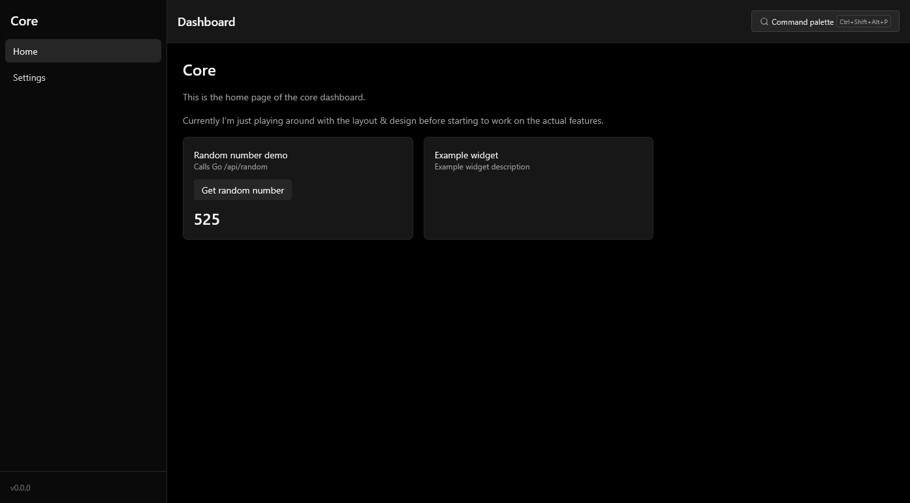

# Core

<p align="center">
  
  
  
  <a href="https://pkg.go.dev/github.com/matkv/core">
    
  </a>
</p>

A Go CLI app to automate some personal tasks - mainly a project for learning & experimenting with Go. This is meant to be a little pocket-knife for various random tasks I'd like to run in the terminal so I don't really mind if the features are a bit bloated or unfocused. It uses [Cobra](https://github.com/spf13/cobra) & [Viper](https://github.com/spf13/viper) for the CLI and [SvelteKit](https://kit.svelte.dev/) for a web UI. I'm trying to write most of the Go code myself, but in the web app some vibe-coding is allowed 😉.



## Features

- [x] CLI & config management with Cobra & Viper
- [x] Embedded SvelteKit web UI
- [x] `core browser` command to open multiple pre-defined URLs in the default browser
- [ ] System tray mode
- [ ] `core pick` command to pick one option from multiple provided arguments
- [ ] `core journal` command to add journal entries to my Obisidan vault from the CLI or web UI

## Installation

There are two ways to install this app:
1. **Pre-built binaries**: Download the latest release from the [Releases](https://github.com/matkv/core/releases) page
2. **Go install**: If you have Go installed, you can run `go install github.com/matkv/core@latest`

## Configuration

The app uses a configuration file located in the home directory of the user (on Linux `~/.config/core/config.yaml` ) by default. If it doesn't exist yet, it will be created with default settings on the first run.

```yaml
paths:
  obsidianvault: /home/matkv/documents/Obsidian Vault
device: desktop
```

The three supported device types are `desktop`, `laptop` and `wsl`.

## Development

There are two different launch options:
- **Debug CLI**: Starts the GO CLI app with working breakpoints. Command line arguments can be set in then `launch.json` file.
- **Debug web app**: Starts the SvelteKit web app with working Go & Svelte breakpoints.

To make sure that changes in the web app are included in the binary when installing it with `go install`, the web app must be built and the changes need to be commited:

```bash
make build-web
git add web/build
```